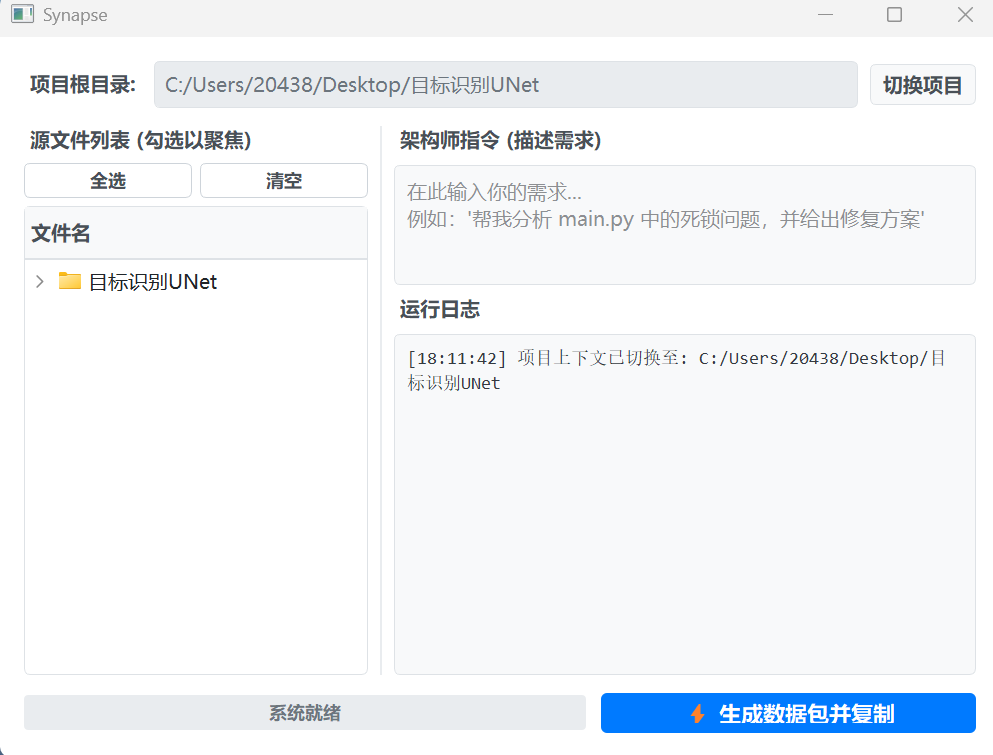

<div align="center">

# 🌉 Synapse

**连接人类意图与 AI 执行的上下文神经桥**

[](https://www.python.org/)
[](https://riverbankcomputing.com/software/pyqt/)
[](https://github.com/)
[](LICENSE)

[功能特性](#-核心特性-key-features) • [工作流](#-工作流-workflow) • [快速开始](#-快速开始-quick-start) • [协议规范](#-协议规范-protocol)

</div>

---

## 📖 简介 (Introduction)

**Bridge** 是一个专为 **"Human -> Web LLM -> AI Editor"** 工作流设计的上下文序列化工具。

在 AI 辅助编程的时代，我们经常需要在 Web 端大模型（如 Gemini 1.5 Pro, GPT-4o, Claude 3.5）和本地 IDE（如 Trae, Cursor）之间反复横跳。Bridge 解决了**“如何让 Web LLM 瞬间看懂我的本地项目”**以及**“如何让 LLM 输出 IDE 能直接执行的代码”**这两个核心痛点。

它不仅仅是一个代码打包器，它是一个**协议转换器**。它将本地代码仓库转换为架构师视图（Symbol Map），并强制 LLM 输出标准化的施工指令（Spec）。

## 📸 运行截图 (Screenshot)

<div align="center">
  
  <br>
  <em>Bridge 的极简主义控制台界面</em>
</div>

## ✨ 核心特性 (Key Features)

| 特性 | 描述 |
| :--- | :--- |
| **🔍 符号映射 (Symbol Map)** | 自动提取 Class 与 Def 摘要，生成项目骨架地图，让 LLM 不再盲读海量代码，Token 节省 30%+。 |
| **🎯 聚焦模式 (Focus Mode)** | 在 UI 树中勾选特定文件，自动覆盖大小限制，实现对关键文件的“显微镜级”分析。 |
| **📋 自动协议 (Auto-Protocol)** | 内置 Prompt 注入系统，强制 LLM 输出 `<trae_spec>` 格式指令，包含 `@Filename`, `[Action]`, `[Code]`。 |
| **🔒 安全剪贴板 (Secure)** | 生成的上下文自动写入系统剪贴板，并在 **60 秒后自动销毁**，防止敏感代码泄露。 |
| **🎨 极简 UI (Minimalist)** | 基于 PyQt5 打造的现代化白色极简界面，支持文件全选/清空、状态实时监控。 |

## 🔄 工作流 (Workflow)

```mermaid
graph LR
    A[👨‍💻 人类开发者] -->|1. 选择文件 & 描述需求| B(Bridge 控制台)
    B -->|2. 生成 XML 数据包| C{系统剪贴板}
    C -->|3. 粘贴 (Ctrl+V)| D[☁️ Web LLM (Gemini/GPT)]
    D -->|4. 分析 & 生成 Spec| E[📝 施工指令]
    E -->|5. 投喂| F[🤖 AI 编辑器 (Trae/Cursor)]
    F -->|6. 自动执行修改| G[📂 本地代码库]
